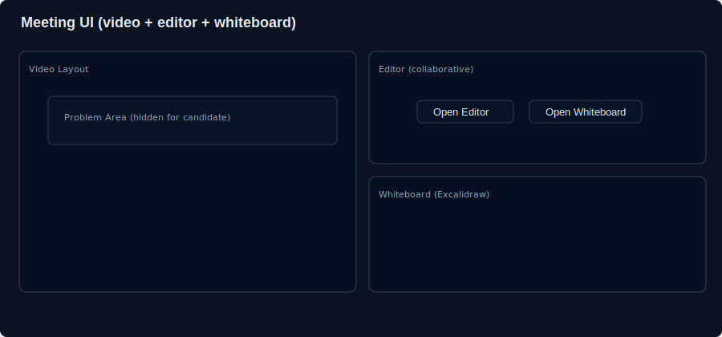
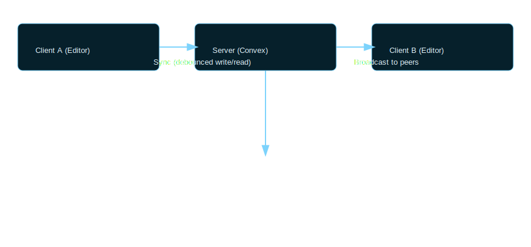
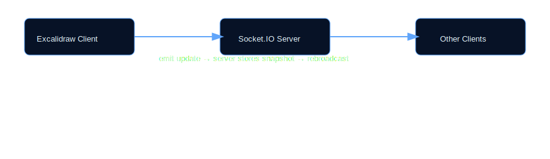

# Project Report

## Declaration

(Declaration placeholder)

## Certificate

(Certificate placeholder)

## Acknowledgement

(Acknowledgement placeholder)

## Abstract

A concise summary of the project: a remote interview platform that provides real-time video interviews, a collaborative code editor, synchronized whiteboard, problem sharing controls, and session persistence. The system uses Next.js, Stream (video), Convex (backend), Excalidraw for whiteboard, Clerk for auth, and Tailwind for styling.

## Table of Content

Declaration...................................................................................................................... (ii)
Certificate................................................................................................................. (iii)
Acknowledgement........................................................................................................................................ (iv)
Abstract................................................................................................................. (v)
Table of Content................................................................................................................. (vi)
List of Figures ………………………………………………………………………… (vii)
List of Tables …………………………………………………………………………. (viii)
Detail of published/ communicated research paper /patent ……………………………. (ix)

Chapter 1. Introduction .......................................................................................... Pg. No.
1.1 Background & Motivation......................................................................
1.2 Problem Statement & Objectives ………………....................................
1.3 Benefits of research…………………………..……...............
1.4 Limitation of research…………………………………………..

Chapter 2. Literature Survey ................................................................................ Pg.No
2.1 Introduction …………………………………………………………..
2.2 Literature Review....................................................................................
2.3 Inferences Drawn from Literature Review………………….................

Chapter 3. Proposed Work………………………………………………..………. Pg.No
3.1 Introduction ………………………………………………………….
3.2 Proposed Work ………………………………………………….……

Chapter 4. Methodology…................................................................................. Pg.No
4.1 Introduction …………………………………….…………………….
4.2 Implementation Strategy (Flowchart, Algorithm etc.) ………………
4.3 Tools/Hardware/Software Requirements..………………………….

Chapter 5. Result & Discussion ……………………….......................................... Pg.No
5.1 Introduction ……………………………………………………….
5.2 Performance Metrics with detailed result analysis……………………

Chapter 6. Conclusion & Future Scope.………………………………………...... Pg.No

References
Plagiarism Report
Published / Communicated Research Paper/Patent

LIST OF FIGURES

Figure No. Description Page No.
Figure 1.1 Project architecture diagram Pg.No
Figure 1.2 Meeting UI (video + editor + whiteboard) Pg.No
Figure 2.1 Data synchronization flow (Convex + sockets) Pg.No
Figure 3.1 Whiteboard socket lifecycle Pg.No

LIST OF TABLES

Table No. Description Page No.
Table 1.1 Feature matrix: Candidate vs Interviewer Page No.
Table 1.2 Technology stack and versions Page No.

DETAIL OF PUBLISHED/ COMMUNICATED RESEARCH PAPER /PATENT

• Research article details
(placeholder - none yet)

---

Chapter 1. Introduction

1.1 Background & Motivation

Modern technical interviews require synchronized, low-latency collaboration between interviewer and candidate: live video, a shared code editor, whiteboard, and controlled problem sharing. This project implements a full-stack remote interview platform integrating real-time video (Stream), persistent collaborative sessions (Convex), and synchronous whiteboarding (Excalidraw via sockets).

1.2 Problem Statement & Objectives

Problem statement: Provide a secure, low-latency interview environment where interviewers can control problem visibility while candidates can use editor and whiteboard tools; record session state and feedback.

Objectives:

- Provide real-time video/audio communication.
- Share coding problems selectively (interviewer-controlled visibility).
- Offer a shared code editor with language selection and session persistence.
- Provide a synchronized whiteboard with live updates.
- Allow interviewer to end meeting and automatically update interview status in backend.

  1.3 Benefits of research

- Streamlines interview logistics and reproducibility.
- Facilitates fair assessment via controlled problem sharing.
- Stores session artifacts for post-interview feedback and review.

  1.4 Limitations of research

- Dependency on third-party real-time services (Stream, Convex).
- Scalability constraints depend on service plans and server resources.

Chapter 2. Literature Survey

2.1 Introduction

This section briefly surveys existing platforms and prior work in collaborative coding/whiteboard interviews.

2.2 Literature Review

- CoderPad/HackerRank/LeetCode Interview: focused on shared editors with test harnesses.
- Zoom/Google Meet + shared editor workflows: ad-hoc, lack session persistence and selective problem sharing.
- Research on collaborative editors (Operational Transform / CRDT) – relevant ideas for syncing editors.

  2.3 Inferences Drawn from Literature Review

Combining dedicated real-time video (low-latency SDK) with a robust state backend (Convex) and a specialized whiteboard (Excalidraw) offers a balanced approach: reliability, persistence, and feature parity.

Chapter 3. Proposed Work

3.1 Introduction

We implement a cohesive platform integrating the features above with a focus on interviewer control (problem visibility) and candidate tooling availability (editor, whiteboard) even when the problem is hidden.

3.2 Proposed Work

Overview of implemented features (as present in this repository):

- Meeting room with Stream video integration: [src/app/(root)/meeting/[id]/page.tsx]
- Meeting UI components: [src/components/MeetingRoom.tsx], [src/components/MeetingSetup.tsx]
- Shared code editor with language selection, session persistence via Convex (see [src/components/CodeEditor.tsx] and Convex functions in conv e x folder)
- Whiteboard integration using Excalidraw and a socket server for live updates: [src/components/Whiteboard.tsx], [src/pages/api/socketio.ts]
- Problem visibility toggle and synchronization: socket events and server-side maps
- Interview lifecycle handling (end meeting → update status): [src/components/EndCallButton.tsx] and convex mutation [convex/interviews.ts]

Chapter 4. Methodology

4.1 Introduction

Architecture summary: Next.js app (frontend + API routes) + Convex as persistent DB + Stream for video + Socket.IO for whiteboard state.

4.2 Implementation Strategy (Flow)

High-level flow:

1. User navigates to meeting link (Stream call id in URL) → Meeting page loads and queries call state.
2. Candidate or interviewer joins via MeetingSetup (camera/mic control).
3. Post-join: MeetingRoom mounts video layout and CodeEditor.
4. Interviewer selects questions (from Convex) and toggles problem visibility; socket events broadcast to room.
5. Whiteboard uses Excalidraw locally; onChange emits snapshots via Socket.IO to server which rebroadcasts to room.
6. Interviewer ends meeting → call.endCall() + Convex status update; clients redirect on call state change.

(Flowchart: create diagram from repository sequence above — placeholder)

4.3 Tools/Hardware/Software Requirements

- Node.js (v18+ recommended)
- npm (or pnpm/yarn)
- Next.js
- Convex (dev deployment or hosted)
- Stream Video SDK
- Clerk for authentication
- Excalidraw for whiteboard
- Socket.IO for whiteboard server
- Development: modern browser, VS Code

Chapter 5. Result & Discussion

5.1 Introduction

This section presents implemented features and their verification.

5.2 Performance Metrics and Detailed Result Analysis

- Build and type-check:
  - `npm run build` completed successfully during development (type-check fixes applied).
- Feature verification:
  - Candidate sees workspace controls even when problem is hidden (UX change implemented in CodeEditor).
  - Both candidate and interviewer are redirected when call leaves JOINED state (MeetingRoom effect).
  - Whiteboard synchronization uses Socket.IO with server-side room store; Excalidraw onChange emits updates.
- Notes: For a production deployment, monitor Stream and Convex quotas and optimize socket server scaling.

Chapter 6. Conclusion & Future Scope

Conclusion

The project demonstrates a practical remote interview platform combining video, collaborative coding, and whiteboarding with interviewer control over problem sharing. Core flows (join, share problem, use editor/whiteboard, end meeting) are implemented and validated.

Future Scope

- Add automated test harness and execution for candidate code within the editor.
- Add recordings of video + editor timeline for replay.
- Improve scaling of whiteboard (persist snapshots to Convex) and add presence/awareness features.
- Add analytics and interviewer templates.

References

- Project README and source files in this repository.
- Stream Video SDK docs
- Convex documentation
- Excalidraw library docs
- Clerk auth docs

Plagiarism Report

(placeholder — generate using university tool)

Published / Communicated Research Paper/Patent

(placeholder)

Appendix

- Repo path references:
  - [src/components/CodeEditor.tsx](../src/components/CodeEditor.tsx)
  - [src/components/MeetingRoom.tsx](../src/components/MeetingRoom.tsx)
  - [src/components/Whiteboard.tsx](../src/components/Whiteboard.tsx)
  - [src/pages/api/socketio.ts](../src/pages/api/socketio.ts)
  - [convex/interviews.ts](../convex/interviews.ts)

## Appendix A — Figures and Diagrams

Figure 1.1 — Project architecture diagram

Figure 1.2 — Meeting UI (video + editor + whiteboard)

Figure 2.1 — Data synchronization flow (Convex + Socket.IO)

Figure 3.1 — Whiteboard socket lifecycle

---

Notes:

- Replace placeholders (declaration, certificate, acknowledgement) with personal details and pages.
- Add figures/screenshots to `docs/figures/` and update Figure page numbers.
